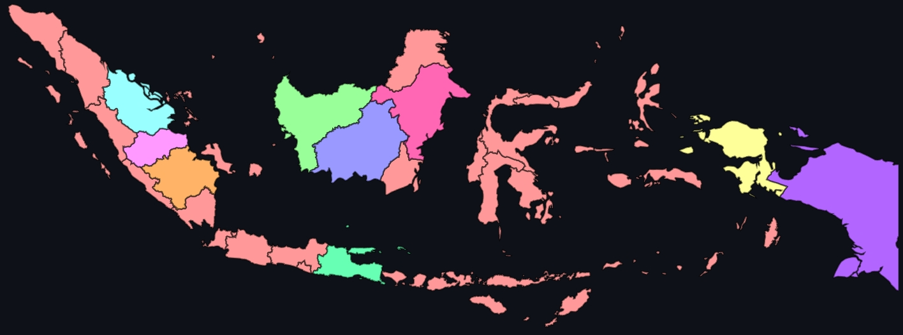

# Exploring K-Means Clustering in Scikit-learn with Streamlit

Try the app here: [K-Means Clustering for Indonesian GHG Emissions](https://indonesia-province-ghg-cluster-map.streamlit.app)



This app lets you explore Scikit-learn's K-Means clustering algorithm using Indonesian greenhouse gas emissions data. You can use your own dataset as a CSV or Excel file to perform the clustering, or you can use the provided example dataset containing greenhouse gas emissions data across Indonesian provinces. If you choose to use your own data, rest assured that it won't be stored anywhere.

You can choose how many dimensions to use for clustering by selecting specific years of data, or include all years for a comprehensive analysis. The application visualizes the clustering results on an interactive map of Indonesia, helping identify patterns and similarities in emissions across different provinces.

# Setup Instructions

## Option 1: Using Virtual Environment (recommended)

First, install virtualenv if you haven't already:
```bash
pip install virtualenv
```

Create and activate a virtual environment:
```bash
# Create virtual environment
python -m venv venv

# Activate virtual environment
# On Unix/MacOS:
source venv/bin/activate
# On Windows:
.\venv\Scripts\activate
```

## Option 2: Direct Installation
If you prefer not to use a virtual environment, you can install dependencies directly:

```bash
pip install -r requirements.txt
```

# Running the Application

After installing the dependencies, you can run the application using:
```
streamlit run app.py
```

The application will open in your default web browser. If it doesn't open automatically, you can access it at http://localhost:8501

To stop the application, press Ctrl+C in the terminal.

# Technical Implementation
- K-Means Clustering for unsupervised learning
- Integration with Scikit-learn ML library
- Streamlit web application development
- Silhouette analysis for optimal cluster determination
- Interactive geospatial visualization using AmCharts
- Data preprocessing and ETL pipeline
- Custom data template generation

Lottie animations from [LottieFiles](https://lottiefiles.com/free-animation/statistics-z17P9Q8377).